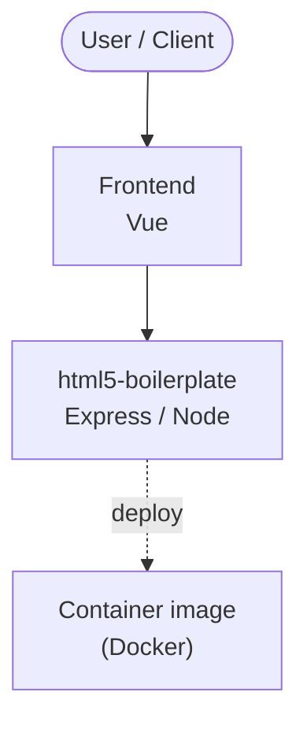

# Context Map — `html5-boilerplate`

> Auto-generated architecture & deployment context map. Summarizes the core application, container/cloud footprint, and database connections. Regenerate after significant structural changes.

**Repo:** `avnit/html5-boilerplate` · **Fork** · Public · Primary language: JavaScript · Default branch: `master` · Files: 81

**Description:** A professional front-end template for building fast, robust, and adaptable web apps or sites.

## 1. Core application

[HTML5 Boilerplate](https://html5boilerplate.com/)

- **Frameworks / runtime:** Express / Node, Vue

## 2. Containers & cloud applications

**Containers:**
- `Dockerfile`

## 3. Database connections

_No database drivers or connection strings detected._

## 4. Architecture diagram

## 5. Security posture

- **Dependabot alerts (open):** 4 high

---
_Generated by repo context-mapping pass on 2026-08-13._